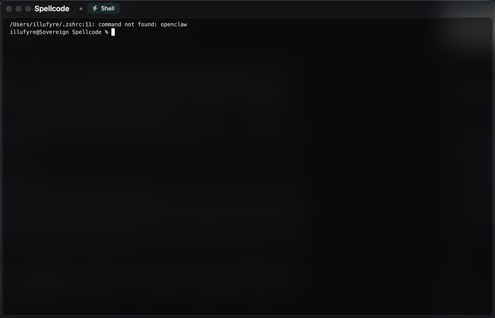

# Spellcode

A black-and-white, GPU-rendered tabbed terminal for macOS, written in Rust with
[GPUI](https://gpui.rs).

[](https://github.com/kawazoeh/Spellcode/actions)
[](https://github.com/kawazoeh/Spellcode/blob/main/LICENSE)
[](https://github.com/kawazoeh/Spellcode/releases)



## Why it exists

A terminal is idle most of the time. Spellcode only repaints a pane when its PTY
produced output or its cursor blinked, so an open but quiet tab costs nothing
while a full repaint costs about as much as a blinking cursor. The tab bar is
the title bar, so no separate chrome row takes vertical space. Every tab is a
real PTY behind a full 256-colour VT emulator, so full-screen programs behave,
while the app's own chrome stays strictly greyscale. There is no built-in
launcher list: a single `config.toml` declares the entries that appear in the
new-tab menu.

It is aimed at macOS developers who want a small, fast, keyboard-first terminal
they can configure with one TOML file and build from a single Rust workspace.

## Installation

### Prebuilt binaries

Download the archive for your platform from the
[Releases](https://github.com/kawazoeh/Spellcode/releases) page: macOS on Apple silicon (arm64), macOS on
Intel (x86_64), and Windows (x64). These builds are not signed or notarised, so
both systems will warn you the first time you open the program.

**macOS.** Move `Spellcode.app` to `/Applications`, then either:

1. Control-click the app in Finder, choose **Open**, and confirm with **Open** in
   the dialog; or
2. clear the quarantine flag from a terminal:

   ```sh
   xattr -dr com.apple.quarantine /Applications/Spellcode.app
   ```

**Windows.** When SmartScreen reports "Windows protected your PC", choose
**More info**, then **Run anyway**.

### Build from source

Requires Rust (see [Building requirements](#building-requirements)).

```sh
git clone https://github.com/kawazoeh/Spellcode spellcode
cd spellcode
cargo build --release
```

The binary is `target/release/spellcode-app`. On macOS you can turn it into a
double-clickable app bundle with an icon and an `Info.plist`:

```sh
scripts/bundle.sh
```

The script writes `target/Spellcode.app`. It takes an optional icon path and
defaults to `assets/spellcode01.png`:


Run the test suite with:

```sh
cargo test
```

## Building requirements

- **Rust 1.85 or newer.** The workspace uses edition 2024.
- **macOS 11.0 or newer** for the current target. The window draws native
  traffic-light buttons over a translucent, blurred surface, and the app bundle
  declares `LSMinimumSystemVersion` 11.0.
- **No full Xcode install is required.** GPUI's default macOS renderer compiles
  its shaders with the Xcode `metal` toolchain, which is not part of the Command
  Line Tools; the default `macos-blade` feature uses the Blade backend instead,
  which validates its WGSL shaders through Rust. `scripts/bundle.sh` uses `sips`
  and `iconutil`, both shipped with macOS, to build the `.icns`.
- **Windows** builds come from the same workspace and are published from CI.
  Building on Windows or Linux from source is not covered by this README.

## Keyboard

| Shortcut                | Action                                       |
| ----------------------- | -------------------------------------------- |
| `+` (click)             | New shell tab                                |
| `+` (right-click)       | Menu: a plain shell, then configured entries |
| tab (left-click)        | Activate that tab                            |
| tab (right-click)       | Rename, icon, background, reset, close       |
| `cmd+t`                 | New shell tab                                |
| `cmd+w`                 | Close the current tab                        |
| `cmd+n` / `cmd+p`       | Next / previous tab                          |
| `cmd+=` / `cmd+-`       | Font size                                    |
| `cmd+0`                 | Reset the font size                          |
| `cmd+v`                 | Paste (bracketed when the program asks)      |
| `cmd+k` (in terminal)   | Clear the screen (sends `Ctrl+L`)            |
| `cmd+l` (in terminal)   | Kill to the end of the line (sends `Ctrl+K`) |
| `cmd+r` (in terminal)   | Jump to the top of the scrollback            |
| `cmd+end` or `cmd+down` | Jump to the bottom                           |
| mouse wheel             | Scroll the scrollback                        |

When a session has exited, `Enter` or `r` restarts it. The right-click menus
are the mouse equivalents of `cmd+w`, so nothing here depends on remembering a
shortcut.

## Configuration

`~/.config/spellcode/config.toml` is created on first launch. It is optional,
and it is the single source of truth: right-clicking `+` lists exactly the
entries declared there, next to a plain shell.

```toml
[general]
# The shell launched by the "Shell" entry. Empty means $SHELL, then /bin/zsh.
shell = ""
# Empty means "try the bundled list below". A family that is not installed is
# skipped rather than silently falling back to a proportional font.
font_family = ""
font_size = 13
line_height = 1.4
scrollback = 10000
# Opacity of the black wash over the macOS blur, for the window chrome.
# Lower is more transparent.
window_tint = 0.45
# Opacity of the terminal background. Lower lets more of the blur through.
terminal_opacity = 0.42
# Even inset between the border of the terminal area and the grid. It absorbs
# the sub-cell remainder too, so the text never touches the border.
padding = 14

[[apps]]
name = "Tracker API"
command = "tracker-api"
args = []
cwd = "~/src/my-repo"           # optional, defaults to the current directory
```

When `font_family` is empty, the first installed family among `JetBrains Mono`,
`SF Mono`, `Menlo`, `Monaco`, `Cascadia Code`, `Fira Code` and `monospace` is
used. A family named in the config that is not installed is skipped rather than
silently falling back to a proportional font.

Entries whose executable is missing from `PATH` are marked *not installed* in
the menu rather than hidden, so you can keep a list that travels between
machines. Remove every `[[apps]]` block to only ever get a shell.

## Look

- The window is translucent and a single black wash covers the whole thing, so
  the macOS blur reads as one surface behind the tab bar and the margins. The
  terminal card is fully opaque on top of it, so text stays readable.
- The chrome is strictly greyscale. The terminal keeps a real 256 colour
  palette, because full-screen programs rely on it.
- Tabs carry a Font Awesome icon on the left and a background colour, both
  chosen from the right-click menu. `Reset` puts them back.
- The dot on a tab reports its state: bright while the session is running, dim
  when the view is scrolled back, faint once the session has exited.

## Layout

```
crates/
  spellcode-term/   no UI: VT emulation and the PTY
    term.rs         TerminalCore over alacritty_terminal
    pty.rs          process spawn, reader thread, input
  spellcode-app/    GPUI
    main.rs         window setup, transparent title bar
    workspace.rs    tab bar, panes, global shortcuts
    overlay.rs      context menu, rename dialog, icon and colour pickers
    icon.rs         bundled Font Awesome face and the curated icon list
    terminal.rs     a session: grid rendering, cursor, key encoding
    keys.rs         keystroke to ANSI byte sequences
    theme.rs        monochrome chrome, 256 colour terminal palette
    config.rs       config.toml loading
```

## How the terminal stays fast

- **Never redraw when nothing happened.** A pane is only notified when the PTY
  produced output or the cursor blinked, so an idle terminal costs nothing. A
  full viewport repaint then costs about as much as a blinking cursor would.
- **One shape call per style run.** Adjacent cells that share a foreground,
  background and weight become a single string, so a 200x50 grid is a few
  hundred shaped lines rather than ten thousand glyphs. GPUI caches the
  resulting layouts, so a repaint of unchanged text is nearly free.
- **Output is drained in batches.** A reader thread fills 64 KiB chunks into a
  channel; the UI polls every 8 ms and feeds everything it finds to the
  emulator in one go, so a program spamming the PTY costs one frame, not one
  frame per write.
- **True 256 colour, 24 bit.** Named, indexed and direct-colour cells are all
  resolved through the full xterm palette, and OSC colour queries are answered
  so shells and prompts detect the real background. The chrome stays strictly
  black and white, the terminal keeps its colours.

## Contributing

Issues and pull requests are welcome. Before opening a pull request, run
`cargo build --release` and `cargo test`, and keep changes focused on one thing.
There is no contribution guide beyond that; ask in the issue if anything is
unclear.

## Security

Please report a security problem privately through this repository's
[security advisories](https://github.com/kawazoeh/Spellcode/security/advisories/new) rather than in a
public issue, so a fix can be prepared before the report is visible.

## License

MIT. See [LICENSE](LICENSE).
